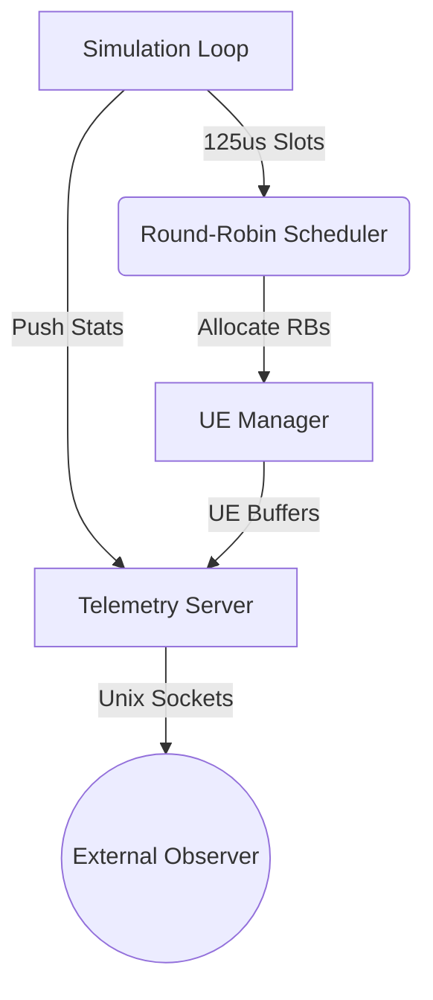

# 6G L1 UE Simulator
[](AGENTS.md)

> **Project Summary:**  
> This is a high-performance C++20 MAC layer simulator mimicking 6G User Equipment (UE) operations. It features a lock-free Round-Robin resource block scheduler and streams real-time telemetry via Unix Domain Sockets. The codebase enforces strict MISRA-inspired warnings (`-Wall -Wextra -Wpedantic -Werror`), utilizes standard Pitchfork layout, and builds deterministically with CMake.

## Table of Contents
1. [System Architecture](#system-architecture)
2. [Getting Started](#getting-started)
3. [Usage](#usage)
4. [Testing](#testing)

## System Architecture



## Getting Started

### Prerequisites
- C++20 compatible compiler (GCC/Clang)
- CMake >= 3.14
- `nlohmann_json` library

### Build Instructions
```bash
mkdir build && cd build
cmake ..
cmake --build .
```

### Docker (Containerization)
For a cloud-native workflow, you can build and run the simulator using Docker:

```bash
docker build -t l1_ue_simulator .
docker run --rm -v /tmp:/tmp l1_ue_simulator
```

## Usage
Run the simulator binary from the build directory. It will open `/tmp/mac_sim.sock` for IPC telemetry and run indefinitely until `SIGINT`.
```bash
./l1_ue_simulator
```

## Testing
Unit tests are integrated via CTest:
```bash
cd build && ctest --output-on-failure
```

## Agentic AI Development
This repository is fully compliant with the [AGENTS.md](https://agents.md) open standard. It includes strict, drop-in operating instructions designed to correctly guide autonomous AI coding agents (such as Cursor, Devin, Copilot, or Antigravity) across the C++20 constraints of this codebase. By providing explicit boundaries, the AI is prevented from hallucinating architectural decisions or making non-deterministic fast-path memory allocations.
